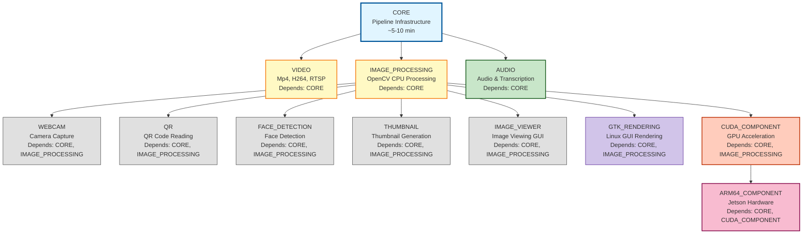
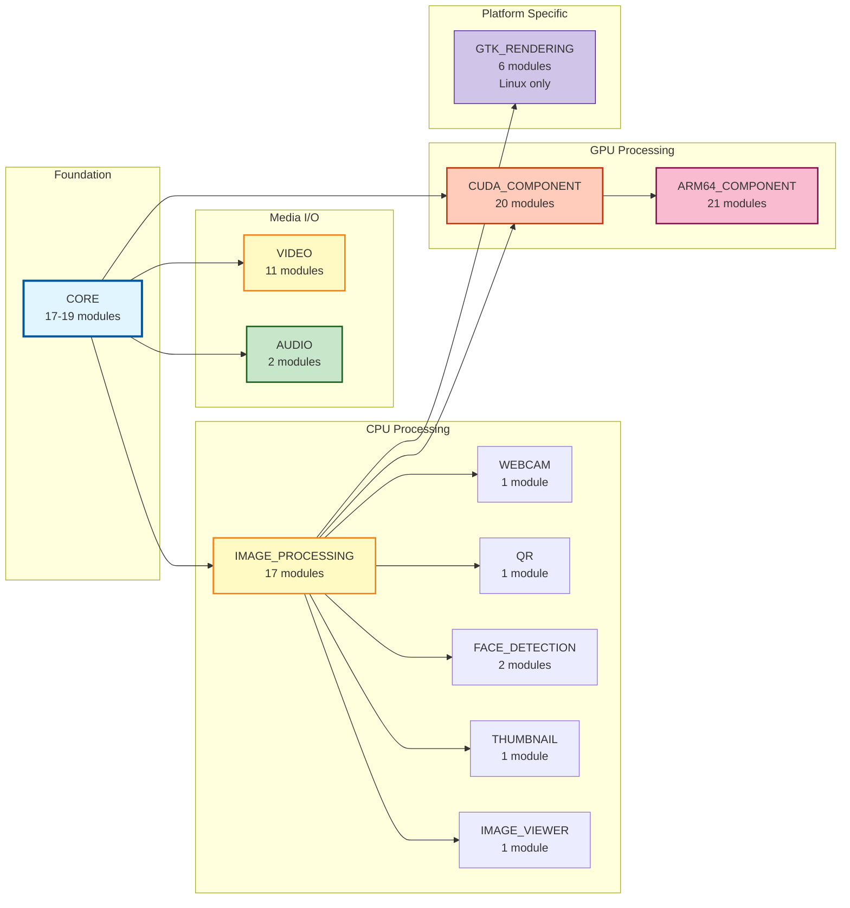
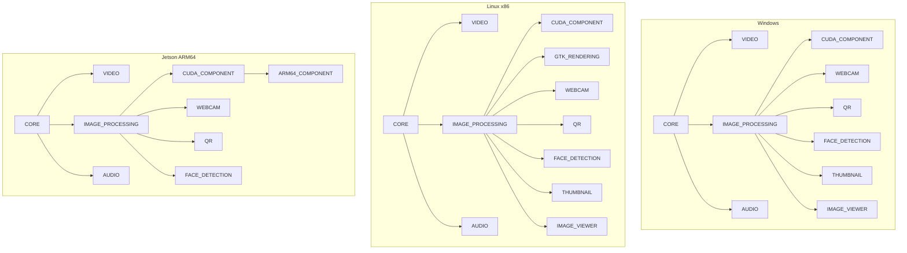

# ApraPipes Component Dependency Diagram

This document provides visual representations of the component dependency structure in ApraPipes.

---

## High-Level Component Dependencies

---

## Detailed Dependency Tree

---

## Component Dependency Matrix

| Component | Depends On | Optional Add-Ons |
|-----------|-----------|------------------|
| **CORE** | _(none - always required)_ | CUDA allocators (if ENABLE_CUDA=ON) |
| **VIDEO** | CORE | - |
| **IMAGE_PROCESSING** | CORE | NPP libraries (if ENABLE_CUDA=ON) |
| **CUDA_COMPONENT** | CORE, IMAGE_PROCESSING | - |
| **ARM64_COMPONENT** | CORE, CUDA_COMPONENT | - |
| **WEBCAM** | CORE, IMAGE_PROCESSING | - |
| **QR** | CORE, IMAGE_PROCESSING | - |
| **AUDIO** | CORE | CUDA (for Whisper acceleration) |
| **FACE_DETECTION** | CORE, IMAGE_PROCESSING | - |
| **GTK_RENDERING** | CORE, IMAGE_PROCESSING | - |
| **THUMBNAIL** | CORE, IMAGE_PROCESSING | - |
| **IMAGE_VIEWER** | CORE, IMAGE_PROCESSING | - |

---

## Common Component Combinations

```mermaid
graph TB
    subgraph "Minimal Build<br/>~5-10 min"
        M_CORE[CORE]
    end

    subgraph "Video Processing<br/>~15-25 min"
        V_CORE[CORE]
        V_VIDEO[VIDEO]
        V_IP[IMAGE_PROCESSING]

        V_CORE --> V_VIDEO
        V_CORE --> V_IP
    end

    subgraph "CUDA Accelerated<br/>~30-40 min"
        C_CORE[CORE]
        C_VIDEO[VIDEO]
        C_IP[IMAGE_PROCESSING]
        C_CUDA[CUDA_COMPONENT]

        C_CORE --> C_VIDEO
        C_CORE --> C_IP
        C_IP --> C_CUDA
    end

    subgraph "Jetson Platform<br/>~60-90 min"
        J_CORE[CORE]
        J_VIDEO[VIDEO]
        J_IP[IMAGE_PROCESSING]
        J_CUDA[CUDA_COMPONENT]
        J_ARM64[ARM64_COMPONENT]

        J_CORE --> J_VIDEO
        J_CORE --> J_IP
        J_IP --> J_CUDA
        J_CUDA --> J_ARM64
    end

    style M_CORE fill:#e1f5ff,stroke:#01579b,stroke-width:3px
    style V_CORE fill:#e1f5ff,stroke:#01579b,stroke-width:3px
    style V_VIDEO fill:#fff9c4,stroke:#f57f17,stroke-width:2px
    style V_IP fill:#fff9c4,stroke:#f57f17,stroke-width:2px
    style C_CORE fill:#e1f5ff,stroke:#01579b,stroke-width:3px
    style C_VIDEO fill:#fff9c4,stroke:#f57f17,stroke-width:2px
    style C_IP fill:#fff9c4,stroke:#f57f17,stroke-width:2px
    style C_CUDA fill:#ffccbc,stroke:#bf360c,stroke-width:2px
    style J_CORE fill:#e1f5ff,stroke:#01579b,stroke-width:3px
    style J_VIDEO fill:#fff9c4,stroke:#f57f17,stroke-width:2px
    style J_IP fill:#fff9c4,stroke:#f57f17,stroke-width:2px
    style J_CUDA fill:#ffccbc,stroke:#bf360c,stroke-width:2px
    style J_ARM64 fill:#f8bbd0,stroke:#880e4f,stroke-width:2px
```

---

## Dependency Legend

- **Blue (CORE)**: Foundation layer - always required
- **Yellow (VIDEO, IMAGE_PROCESSING)**: Media processing components
- **Orange (CUDA_COMPONENT)**: GPU acceleration
- **Pink (ARM64_COMPONENT)**: Jetson-specific hardware
- **Green (AUDIO)**: Audio processing
- **Purple (GTK_RENDERING)**: Linux-specific rendering
- **Gray (Specialized)**: Specialized single-purpose components

---

## Platform-Specific Dependencies

---

## Notes

1. **CORE** is always required and serves as the foundation
2. **IMAGE_PROCESSING** is a common dependency for most specialized components
3. **CUDA_COMPONENT** requires IMAGE_PROCESSING due to shared infrastructure (NPP libraries)
4. **ARM64_COMPONENT** is only available on Jetson platforms and requires CUDA_COMPONENT
5. **GTK_RENDERING** is only available on Linux platforms
6. Components can be enabled independently as long as their dependencies are satisfied

For detailed component information, see [COMPONENTS_GUIDE.md](COMPONENTS_GUIDE.md).
